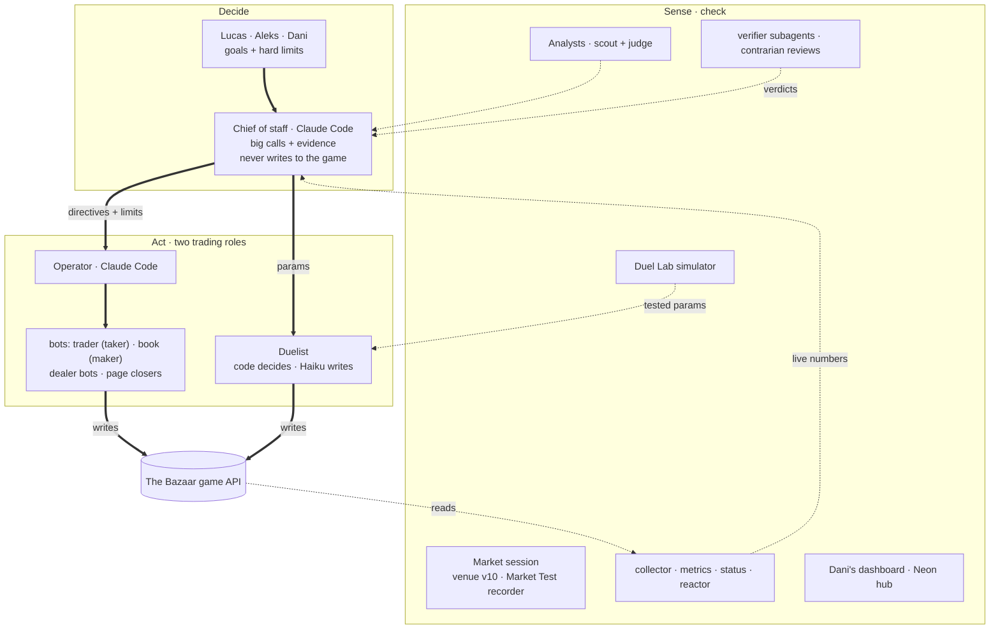

# Team 5 · The Bazaar (Causa Prima, Madrid, Oct 2–4 2026)

**We finished the trading game #1: 37.73** (negotiating 24.64 + market-making 13.08), 1.97 ahead of Team 10. We were #6 after Friday and #3, 7.09 behind Team 10, at Saturday's close, then held #1 at every snapshot from Sunday 12:35 to the close (`evidence/leaderboard.jsonl`).

We built a **control room of Claude Code sessions**: three humans set the goals and the hard limits, a Chief of staff session makes the big calls and logs each with its evidence, only two roles trade (the Operator with its bots, and the Duelist), and everything else senses or checks. **The pitch:** [`judges/pitch/sunday/`](judges/pitch/sunday/) (`deck.html` works offline; `script.md`; `submit-story.md`).

## Read this repo in 10 minutes

1. **The pitch:** `judges/pitch/sunday/deck.html` (or `team5-deck.pdf`) and `script.md`: what we built and why, in 3 slides.
2. **The architecture:** the diagram below, then `agents/README.md` and `tools/README.md`.
3. **The decisions:** `intel/directives.md`: every big call, newest on top, with its time and evidence (100 in 38 hours).
4. **What we measured:** `intel/GAME.md`, including the beliefs our own data broke.
5. **The duelist:** `docs/duelist-sunday-summary.md`, then the code on branch `duelist-loop` (tag `sunday-final-duelist`).
6. **The evidence:** `evidence/` (final leaderboard and score data) and `docs/duels/` (every duel). Every number in the pitch traces back here.

## Repo map

| Area | Folders |
|---|---|
| **Built** (code) | `agents/` (what acts), `engine/` (the LLM layer), `tools/` (daemons, guards, helpers), `broker/` (Market Test lab), `hub/` (shared Neon archive + demand model), `dashboard/` (live dashboard + judges' showcase), `tests/` |
| **Decided and measured** | `intel/` (decisions, facts, analyses), `team/` (one log per person), `evidence/` (frozen game data), `docs/` (duelist docs + every duel record), `STATUS.md` (last live numbers) |
| **Presented** | `judges/` (pitch, demo, showcase brief) |
| **History** | `research/` (before the rules), `archive/` (Friday, round snapshots, old drafts), `LOG.md` (experiments E1-E7), `DECISIONS.md`, `PLAN.md`, `designs/` |

Every folder has a short `README.md` with its own map. `CLAUDE.md` holds the shared rules the humans and Claude Code sessions followed.

## Architecture

Solid arrows: authority, or a write to the game. Dotted arrows: data flowing back.

## Where everything is

| Component | What it does | Path |
|---|---|---|
| Duelist | Duels: code decides accept, hold, step and delivery day; Claude Haiku 4.5 writes the words; guards, 8 s failover, hot-reloaded params, C → A switch | `agents/duelist/` (main) · **Sunday duelist: tag `sunday-final-duelist` = f57a002 on branch `duelist-loop`** |
| LLM engine | `Model` interface and the Claude provider the agents run on | `engine/` |
| Dealer bots | Negotiated dealer deals with a trick guard and cash floors | `agents/dealers/` |
| Trader | `loop.py` (taker) and `book.py` (maker book) | `agents/trader/` |
| Analysts | Scout and judge on the Claude API | `agents/analyst/` |
| Market Test lab | `record_bench.py` records every Market Test; `sim.py` tests broker strategies offline against the free stall | `broker/` |
| Daemons and tools | `daemons.sh` (19 defined), collector → `data/`, metrics, `status.py` → `STATUS.md`, reactor, matchmaker, v10 radar, policy, notify | `tools/` |
| Sunday scripts | Sequenced page closers, venue ads, duel windows | `tools/sunday/` |
| Dashboard | Dani's live, read-only dashboard and the judges' showcase (`/show`) | `dashboard/` |
| Hub | One shared copy of the game in Neon Postgres + a demand model (no LLM) | `hub/` |
| Decisions and facts | `directives.md` (every big call + evidence), `GAME.md` (measured facts), `duel-lab.md`, `duel-review.md`, `market-log.md`, `standings.md` | `intel/` |
| Team logs | One file per person: Now line + `time · what · result · next` | `team/` |
| Duel records | Every duel, as JSON | `docs/duels/` |
| Research | Evidence base, hypotheses and experiment plan from before the rules came out | `research/` |
| The pitch | Deck, script, submit story, review of the judging criteria | `judges/pitch/sunday/` |

## How the sessions coordinated

- **`CLAUDE.md`**: the shared rules and repo map every human and Claude Code session reads first.
- **`intel/directives.md`**: the decision log, newest on top, with times and evidence; hard limits change through a `GUARDRAIL` line.
- **`team/*.md`**: one file per owner, so pushes never conflict (`merge=union` in `.gitattributes`); hooks pull at every prompt and push after every turn.
- **`STATUS.md`**: live numbers, rewritten every 5 minutes by `tools/status.py`.
- Claude Code sessions also message each other directly; humans get phone alerts (`tools/notify.py`).

## Where the evidence lives

- **Score and race:** `evidence/leaderboard.jsonl`, `evidence/me.jsonl`, `STATUS.md`, `intel/standings.md`.
- **Duelist:** `docs/duelist-sunday-summary.md` (what changed, how it was tested), `intel/duel-lab.md` (simulator), `intel/duel-review.md` (every wave reviewed), `docs/duels/`.
- **Market:** `intel/market-log.md`, `evidence/bench/`.
- **Rules:** `bazaar-kit/RULES.md` (the organisers' kit; not ours).

## History

`archive/` holds earlier material: Friday's and each round's raw data and analyses, old pitch drafts (`archive/pitch-drafts/`) and design history (`archive/history/`). `LOG.md` keeps the experiment log. Keys live only in a git-ignored `.env`; start from `.env.example`.
