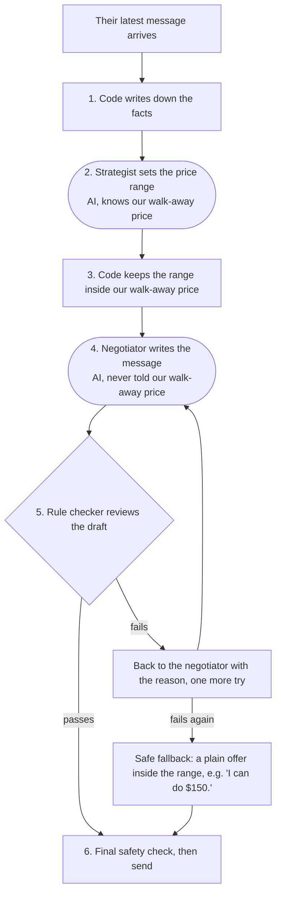

# How Regateo's leading model works

As of 2 October 2026.

## The short version

Our best negotiator is called **Clock-Standing** (its full name in the code is `ranged/v4/clock-standing`). It haggles over a price on behalf of a buyer or a seller, by chat, against another team's AI.

It works like a small sales team of three:

- **A strategist** knows our secret budget and decides, each turn, the range of prices we are willing to offer.
- **A negotiator** writes the actual message to the other side. It must pick a price inside that range, and it is never told our budget.
- **A rule checker** (ordinary code, not AI) blocks any message that breaks a rule, such as going past our budget.

The strategist and the negotiator are the same AI language model (Qwen, running on our own computer), given two different job descriptions. Two things make this version stand out: it is told how much time is left and how close the two sides are, so it closes near-deals instead of losing them; and it never offers a worse price than one the other side has already put on the table.

On 2 October 2026 it became our reference agent. It came first in a six-agent league, keeping on average 58% of the value available in each deal, closing 92% of its negotiations, and never agreeing to a deal past its budget.

## The game it plays

Regateo is our entry for a hackathon tournament where AI agents negotiate prices with each other, one on one. One agent is the buyer, the other the seller, and they trade chat messages until one accepts the other's offer or they run out of messages.

**Each side has a secret walk-away price.** The seller has a lowest price it will take, and the buyer a highest price it will pay. Neither knows the other's. Both see a public hint: what comparable items usually sell for.

**The score is the share of the available value we keep.** Say the seller won't go below $80 and the buyer won't pay above $120. There is $40 of room between them. If they settle at $110, the seller has kept $30 of that $40, a share of 75%, and the buyer 25%. A deal exactly at our own walk-away price scores 0%. **No deal at all also scores 0**, however close the two sides came.

**Time is short.** In our tests each side may send six messages. Sometimes both sides know that limit; sometimes it is hidden, and the conversation can stop after any message.

**The other side may play dirty.** The tournament allows bluffs, fake deadlines, invented rival offers, fake acceptances and "prompt injection" (text that tries to give our AI orders). Our agent has to stay calm and judge the other side by the prices it actually offers, not by what it claims.

## How it makes each move

Every time it is our turn to speak, the same six steps run. Think of a car dealership: the sales manager knows the lowest price the dealership can accept and tells the salesperson "today you can go between $130 and $135". The salesperson talks to the customer without ever knowing the true floor, so they can't let it slip. A compliance officer reads every offer before it goes out.

Rounded boxes use the AI language model; square boxes are plain code.

1. **Code writes down the facts.** Before any AI is asked anything, plain code makes a tally from the conversation: every offer each side has made, how far each side has moved from its first offer, how many messages each side has sent, whether the message limit is known, whether our next message is the very last one, and how far apart the two latest offers are. It states facts only and never suggests a price.
2. **The strategist sets the range.** It is the only part that knows our walk-away price. It reads the conversation and the tally, then returns a short plan: what the other side's last message really offers and how far to trust it, a target price, the range the negotiator may move in, and one point to stress. Its instructions boil down to a few rules of thumb:
    - Open ambitiously, near the end of the usual price range that favours us.
    - Give ground only after the other side has, by less than they did, in shrinking steps. If they haven't moved, hold.
    - Treat deadlines, rival offers and "final offers" as possible bluffs. Judge the other side by the prices it actually offers.
    - Never counter with a price worse than one they have already offered us.
    - Mind the clock. With a known limit, holding costs nothing until the last two messages. With a hidden limit, once their offer is acceptable and the gap is small compared with how far both sides have already moved, accept it or split the difference once, rather than risk the whole deal for a few dollars.
3. **Code keeps the range inside our walk-away price.** If the strategist's plan goes past it, the strategist gets one more try; whatever comes back is then trimmed to stay inside.
4. **The negotiator writes the message.** It sees the conversation and the strategist's brief, but never our walk-away price: it can't leak what it doesn't know, even if the other side tries to trick it. It picks a price inside the range and writes a persuasive message with reasons grounded in the item and the market. It is told not to repeat the other side's numbers ("your offer" instead), not to use words like "deal" or "agree" unless it is really accepting, and never to mention a range or a strategist.
5. **The rule checker reviews the draft.** It blocks a draft if the price is outside the range, if it accepts an offer worse than the range allows, if the text mentions any amount past our walk-away price, if it sounds like agreement without accepting, or if it offers worse than what the other side already has on the table. A blocked draft goes back to the negotiator with the reason, for one more try. If that fails too, the agent sends a plain, safe offer inside the range instead.
6. **A final safety check, then send.** Whatever happened before, nothing that agrees to a price past our walk-away price ever leaves.

Each turn costs two AI calls (strategist and negotiator), plus one more for each retry.

**A worked example** (made-up numbers). We are the seller; our walk-away price is $80 and similar items sell for $90 to $140. The message limit is hidden. So far we have asked $138, $134 and $128; the buyer has offered $95, $105 and $118. The tally tells the strategist: they have moved $23 toward us, we have moved $10, and the gap is $10. Their $118 is well above our $80, and $10 is small next to the $33 both sides have already moved. So the strategist lets the negotiator accept $118 or split the gap once, at about $123, rather than risk running out of messages. If the buyer's secret limit was $130, a deal at $118 keeps 38 of the 50 dollars of room, a share of 0.76.

## How it got here

Clock-Standing is the fourth version of this design, and each version fixed a mistake we saw in the previous one's games. None of the fixes hands the pricing to code: code only adds facts and safety rails, and the AI still chooses every price.

| Version | What it added | The mistake it fixed |
| --- | --- | --- |
| v4 (Clock-Standing) | Tells the strategist how many messages each side has sent, whether the limit is known, whether our next message is the last, and how far apart the two latest offers are. Also corrected a fact that had been stated backwards. | Deals were lost by a whisker. With a hidden message limit, 62 of 84 failed negotiations ended with the other side's offer already acceptable to us, about 6% of the price range away. Separately, the tally said the other side "had not moved toward us" exactly when they had. |
| v3 | A rule: never offer a worse price than the other side has already offered. The AI must either accept their offer or ask for something better. | In 15% of games the agent offered worse than what was on the table, e.g. a buyer bidding $135 when the seller was already asking only $91. |
| v2 | A running tally of both sides' offers for the strategist, and the rule "only give ground when they do, and by less". | Against stubborn opponents v1 gave away its range in big steps while they sat still, then closed close to its own limit. |
| v1 | The strategist-and-negotiator split, with code holding the negotiator inside the strategist's price range. | Starting point: one AI doing everything could talk itself into bad deals. |

Two sibling versions were tested alongside it and dropped: one without the clock (to measure what the clock adds) and one that also banned calling an offer "final" unless it really was the last message.

## How we know it is the best

Clock-Standing passed all four of our tests, and did better on opponents it had never met than on the ones it was tuned against.

Every test compares it with our **baseline**, a simpler agent where one AI call does everything. Both play the same scenarios against the same opponents, once as buyer and once as seller, so luck in the scenario cancels out. A gain of +0.14 means it kept, on average, 14 more percentage points of the available value than the baseline did in the same situation.

| Test | What it checks | Result against the baseline |
| --- | --- | --- |
| Practice games (240 paired scenarios) | Three AI opponents: a tough one, a manipulator and one that tries to give our agent orders | +0.14, very unlikely to be luck (p < 0.0001) |
| Unseen opponents | Five opponents it was never tuned on, in both roles and with 5 or 10 messages | +0.19 (p < 0.0001). It closed a deal within its budget in 94% of games, against 81% for the baseline. |
| Attack drills ("red team") | Opponents built to exploit known weak spots | +0.07 (p < 0.0001), the best of any agent so far. No deal past its budget. |
| League | Six agents, every pair 20 games, 10 in each role | First place, rating 1631. Mean share 58%, deals closed 92%. |

In the league it came out ahead of every other agent head to head:

| Opponent | Clock-Standing's share | Opponent's share | Deals closed |
| --- | --- | --- | --- |
| An AI with only the strategy prompt (o1-qwen) | 0.730 | 0.270 | 20 of 20 |
| An AI with the strategy prompt and code checks (o2-qwen) | 0.634 | 0.266 | 18 of 20 |
| Boulware (a classic rule-based haggler that concedes slowly) | 0.593 | 0.357 | 19 of 20 |
| Baseline | 0.539 | 0.461 | 20 of 20 |
| Tough AI persona (tough-qwen) | 0.406 | 0.344 | 15 of 20 |

The two shares of a pair can add up to less than 1 because a failed negotiation scores 0 for both. Against the baseline and the tough persona, 20 games is too few to call the lead certain on its own.

Why the clock helped: against the previous champion it closed more deals (70 failed negotiations instead of 104) and offered worse than the other side's standing offer in 4% of games instead of 13%.

## Where it still falls short

Clock-Standing is the best we have, not a finished product. These are the weak spots we know of:

- **A clever adaptive attacker still hurts it.** An AI opponent that thinks before it answers and has been briefed on our weaknesses costs it about 0.29 of share. It costs every agent we have, including the baseline, about the same.
- **The "quote and accept" trick works on it.** The opponent gets our agent to restate the opponent's price, then "accepts" it as if we had offered it. This costs about 0.19 of share. The simpler baseline does not fall for it.
- **Against an opponent that never moves**, it does slightly worse than the baseline (0.05, small enough to be chance).
- **Some league margins are thin.** Its lead over the baseline and the tough persona rests on 20 games each, too few to be sure on their own.
- **We only know our own practice world.** All opponents ran on the same local AI model, under our guess at the tournament's rules. The real tournament's message format, time limits and scoring are still partly unknown.
- **Not everything is measured yet.** What the corrected "backwards fact" is worth on its own is unknown, and nobody has read the transcripts of the games against unseen opponents.
- **It reads suspicious offers cautiously.** If a message mentions a rival's price and then the real offer, it assumes the worse of the two for us when judging how close the sides are. That is safe, but it can make a good offer look worse than it is.

## Glossary

| Term | Meaning |
| --- | --- |
| Agent | A program that negotiates on its own, here built around an AI language model. |
| Baseline | Our simplest serious agent: one AI call per turn plus safety checks. The yardstick every new version is measured against. |
| Band | The range of prices the negotiator may offer this turn, set by the strategist. |
| Gap | How far apart our latest offer and the other side's latest offer are. |
| Language model | The AI that reads and writes text. Clock-Standing uses Qwen, run on our own computer. |
| League | A round-robin tournament between our agents and practice opponents, producing a ranking. |
| Ledger | The tally of facts the code gives the strategist each turn: offers so far, how far each side has moved, messages sent and left. |
| p-value (p) | How likely a result this large would be by pure chance. p < 0.0001 means less than 1 in 10,000. |
| Red team | Opponents designed to attack our known weak spots. |
| Reference | The agent currently considered our best, which new versions must beat. Clock-Standing since 2 October 2026. |
| Share | The part of the available value (the room between the two walk-away prices) that a deal gives us, from 0 to 1. |
| Standing offer | The other side's latest offer, still on the table. |
| Unseen opponents | Opponents kept apart during development, so a good result there is not just tuning to the practice opponents. |
| Veto | The rule checker blocking a draft message and asking the AI to try again. |
| Walk-away price | The worst price a side will accept: the seller's minimum or the buyer's maximum. Kept secret. |
