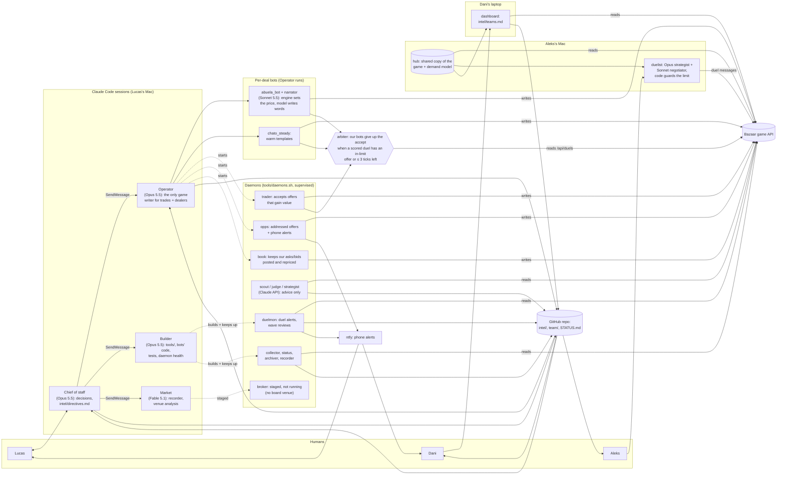

# Team 5: what we measured (judges' evidence layer)

The evidence under `DECISIONS.md` (Dani, 22 decisions) and `judges/demo.md`: every finding we measured in the game,
when, the evidence, what it changed, and the decision it fed (**Decisions** column: `DECISIONS.md` entry numbers).
Sources: `intel/GAME.md`, `intel/directives.md`, `LOG.md`, `team/lucas.md`, `team/aleks.md`, `team/dani.md` (as of Sat
~10:53). Fri = Oct 2, Sat = Oct 3. `neg_points` = our private negotiating counter. Rows marked "corrected by #N" were
wrong and are kept on purpose. Drafted from the sources and checked row by row by a separate verifier agent.

| # | Finding | When | Evidence | How it changed our play | Status | Decisions |
|---|---|---|---|---|---|---|
| | **Scoring & values** | | | | | |
| 1 | Team-trade score = Δ our collection value − price − fee, and only the taker pays the fee (ceil(5% × price) + 1 P per card) | Fri 21:12; re-verified Sat 00:00-01:15 | Spare MAL-02 sold at 6 by accepting: `neg_points` −8.5 → −6.1 (+2.4) ≈ 6 − 2 fee − 1.75 value (LOG Fri 21:12) | "Be the maker" (LOG finding 1); maker ask floor = copy value + 1 (directive 10:30) | [V] | D2 |
| 2 | Score is relative: idle teams fall when others gain | Fri 22:35 (ticks 90-125) | Ticks 115→120: idle t12 −0.43, t10 −0.46, t14 −0.41; our `neg_points` 26.3→30.1 while score 17.8→16.5 (dani.md 22:35). 1 `neg_point` ≈ 0.16 board (GAME.md) | Plan marks it [V] (§1); target 20-30 live maker offers (§4A); 7 live at Sat 10:09 (DECISIONS D6) | [V]; 0.16 rate [L] for Saturday | D6 |
| 3 | Unopened packs drag each trade's score by ~1-4 points | Fri ~22:42 | Explains SAL-08 +1.9, SAL-06 +6.0, LAV-06 −2.3 (GAME.md; lucas.md 22:42) | Open packs before trading: 2 packs opened Fri 22:42; Saturday's grant pack opened on arrival (lucas.md 22:42, Sat 09:37) | [L] | D8 |
| 4 | Private multipliers: CHA 1.6, LAV 1.3, RET 1.1, SAL 0.9, MAL 0.7, LAT 0.5; every team has the same six, shuffled | Fri, by 21:18-21:34 | `GET /api/me` → `affinity` (lucas.md 21:34; LOG finding 9); LOG E1 already prices LAV uncommons at 32.5 | LAV chosen as Friday's page (32.5 per uncommon, LOG finding 0); cash kept for CHA (1.6, out Sunday) (lucas.md Sat 10:29) | Read from server (untagged in GAME.md) | — |
| 5 | Round 2 fired at tick 160 (game hour ~2.7, not 4.0): `neg_points` and ladder reset to 0 for all; holdings carry over | Sat tick 160 (seen 09:37) | `neg_points` 67.8 → 0.0; tick 165 grant 150 P + pack (RET-05, SAL-01, SAL-03); cash 252 → 402 (GAME.md; lucas.md 09:37) | — | [V] | D11 |
| | **Dealers** | | | | | |
| 6 | Dealer buys don't move `neg_points`; only team trades count (LOG findings 0 and 11) | Fri 21:15, 21:38 | LAV-08 from Abuela at 24 (worth 32.5): ~+0.3 vs MAL-08 sold to a team at 26: ~+8.5 (LOG 21:15); finding 11 "measured on 4 trades" | E1 dealer buys stopped 21:16; LAT flips and autoflip started (lucas.md 21:38; LOG finding 12) | Corrected by #7 (LOG finding 13, 22:00) | D2, D3 |
| 7 | Dealer buys above our value subtract in full | Fri 22:00-22:03 (tick 98) | Autoflip bought MAL-07 from Abuela at 29 (worth 17.5): `neg_points` 26.3 → 14.5, the only event between; Team 8's silver pack at 181: board −5.65 (lucas.md 22:01; GAME.md) | Autoflip stopped and archived ("never restart"); never buy from a dealer above value; never buy packs (LOG finding 13; GAME.md) | [V] | D3 |
| 8 | Even a dealer buy just below value subtracted | Fri 22:34 (tick ~133) | LAV-06 from Chato at 31 (worth 32.5): `neg_points` 30.1 → 27.8 (−2.3), ladder unchanged (lucas.md 22:34; dani.md 22:40) | LAV-07 buy stopped; "no dealer buys at all unless Lucas directs one" (lucas.md 22:34) | Reinterpreted as unopened-pack drag (#3), [L] | D8 |
| 9 | Dealer gains don't score; dealer deals pay only through the ladder | Sat 09:41-09:45 | Abuela RET-04 and RET-03 at 9 (worth 11 each): `neg_points` 0 → 0 both, predicted +2 each if gains counted; ladder 0 → 0.014 → 0.032 (lucas.md 09:49) | Deck's Hint 1 "+4" assigned to team trades (directive 09:58); Pilar = "a ladder + cash outlet only" (directive 10:22) | [V, n=2 clean windows] | D17 |
| 10 | Dealer losses score in full, to the decimal | Sat 09:53, 10:04 | RET-09 from Chato at 87 (worth 77): `neg_points` 0 → −10.0; RET-10 at 86: −10 → −19.0; ladder unchanged (lucas.md 09:55, 10:05) | RET-10 cap raised 88 → 91 to close the page (directive 10:03); Dani flagged it skipped GUARDRAIL (dani.md 10:16) | [V] | D20 |
| 11 | Abuela opens high (common 12, uncommon 29, pack 30) and ends lower the more rounds run; opened low (pack 17, common 7), she never moves | Fri 21:00 (feed ticks 4-36) | 50 feed conversations (LOG 21:00, finding 1: ends ~73-75%); GAME.md: common 9-10, uncommon 21-24, pack 19 after 8 rounds | "More Abuela deals add almost nothing" (best 3 per level, ours at her floor): effort to next dealers, market, duels (LOG finding 2) | [V] (GAME.md version); LOG's ~73-75% untagged; welcome price not reset Sat [L] | — |
| 12 | Abuela gifts a card after a team's 5th deal of the day | Sat tick 261 | LAT-08 "gift from Abuela Carmen" (`gift.given`); Team 7 got LAT-06 on Friday, tick 157 (GAME.md; lucas.md 10:40) | LAT-08 put in the book → t15 at 22 (floor 15, worth 12.5) (lucas.md 10:40) | [V]; operator's 10:30 "we don't hold it" corrected at 10:40 | — |
| 13 | Chato's rare final lands at 86-87 once our +3 steps reach ~69; at 66 it was 91 | Sat 09:53-10:05 | RET-09: 97, 96, 95, 90, FINAL 87 (our 57 → 69); RET-10: FINAL 91 at our 66 (walked, cap 88), retry FINAL 86 at 69 (GAME.md) | — (pattern fitted from these deals; no later decision recorded) | [L, n=3] | D20 |
| 14 | Chato mirrors our step size and finals after ~4-5 rounds; Friday's +1-step protocol fails | Sat 10:07-10:10 | Fri: +1 steps → 28-29. Sat RET-06, our 18 → 21 by +1: his 33, 33, 32, FINAL 31 in 4 rounds, "You moved one, I moved one" (GAME.md) | Walked; directive 10:10: steps +2/+3, cap 31; "RET uncommons go to Abuela" (GAME.md) | [V, n=1 + Friday] | D22 |
| 15 | Warm words seemed to get 1 P more from Chato | Sat 10:16 | Warm run (open 20, +3, greeting): his 33, 33, 33, 32, 31, then he accepted our 30; `neg_points` −19 → −21.5. Cold run finalled 31 (lucas.md 10:16) | Narrator (e444ecf, ordered 10:08, before the test) kept as harmless; its price effect logged as open (directive 10:35) | [Open]: confounded with step size (+3 vs +1); RULES: words never change prices | D22 |
| 16 | Three negotiated Chato deals would unlock level 3 early (inferred, not measured) | Sat 09:46-10:10 | Deck: "good negotiated deals with the previous dealer earn an early start" (directive 09:46); level 2 opened early for 3 negotiated Abuela deals (GAME.md [V]) | 3rd Chato deal (RET-06 at 30) bought for the unlock (directive 10:10); cost ≈ −2.5 vs Abuela (directive 10:22) | Inference; corrected by #17 ("my 10:10 call was wrong") | — |
| 17 | Ladder and early unlock count only dealer deals below list price | Sat 10:22-10:24 | Below-list Abuela deals moved our ladder (9 vs 10; RET-08 22 vs 25); our 6 above-list Chato deals never did; Team 13's 3 unlocked Pilar (tick 262), ours didn't (GAME.md) | "No more deals to chase early access"; Pilar ladder deals must beat her list (directive 10:22) | [L, strong pattern]; replaces Friday's ladder [?] | — |
| | **Team trades & pages** | | | | | |
| 18 | Friday's big score jumps came from rare cards traded between teams, not from Abuela | Fri 21:14 | Teams 8, 13, 14 went ~11 → 22-26 with one rare at 65-70 P; Team 18 16.9 → 27.4 buying SAL-10 at 80 (LOG E3, finding 11) | E3 team trading live 21:14, `loop.py` autopilot 21:20; bid 70 for LAV-09 (LOG E3) | Untagged (board observation) | D2 |
| 19 | Feeding a rival costs us: our sale helped a team pass us | Fri 22:35 (sale tick 119) | SAL-06 sold to Team 17 at 26; Team 17 collects SAL, went 15.5 → 17.5 → 23.7 (#3) (dani.md 22:35; LOG finding 8) | Dani proposed no sales into a set a team collects within ~8 points of us (dani.md 22:35); later feeding rules don't cite this case | Untagged (LOG finding) | D7 |
| 20 | Page bonus = 25% of the page's book (265) × multiplier, priced into the last missing card | Fri 22:42 | LAV-09 read 177.1 (was 91) as the only LAV card missing; LAV 86.1, RET 72.9, CHA 106 (GAME.md; lucas.md 22:42) | Public bid for LAV-09 at 125 (offer 2353, +52 if filled) (lucas.md 22:42) | [V] | D9 |
| 21 | The page bonus scores only when a team trade completes the page | Fri ~22:40 | Team 17 +6.25 board closing via a team trade; Teams 10/7/12 +2.1/+1.1/+1.0 closing via Chato (GAME.md) | Dani's "buy LAV-09 from Chato" refused (directive 22:40); LAV recipe ends with a team buy (lucas.md 22:46, 22:54) | [L] | D9 |
| 22 | LAV page complete: the closing team trade scored +50.0 | Fri 22:54 | LAV-05 → Abuela at 5 (−8.0), LAV-09 ← Chato at 93 (−2.0), LAV-05 ← team ask 2398 at 8 (+50.0): `neg_points` 27.8 → 67.8 (lucas.md 22:54) | Saturday: RET page "with the same recipe" (lucas.md 22:54, 22:59) | Measured; rank #9 → #5 (lucas.md 22:59), LOG finding 3 says #10 → #5 | D9 |
| 23 | Per-trade cap = 50 | Fri 22:54 (n=1); Sat 10:27 (n=2) | RET-01 from Team 10 at 20 as maker (bid 4167): `neg_points` −21.5 → +28.5 = +50.0 exactly, uncapped 63.9 (lucas.md 10:27); Fri LAV-05, value 99.1 → +50.0 (GAME.md) | GUARDRAIL 10:25 (floor 97, bid ≤ 30) ran the test; pricing rule: a page-closer is worth at most 50 + price (GAME.md) | [V, n=2]; rules out 5×(price+fee) and 6×book; flat 50 vs 5×book still open | D9, D20 |
| 24 | RET page complete (our 2nd page); RET net +28.5 for the day | Sat 10:27 | Rares −19 (RET-09 87, RET-10 86), uncommons −2.5, page close +50; board #4 (24.01) at 10:32 (lucas.md 10:27, 10:32) | Floor back to 100, since GUARDRAIL 10:25 covered RET-01 only (lucas.md 10:27) | [Verified] (directive 10:30) | D20 |
| 25 | Only one LAV-09 exists in the game | Fri 21:28 | lucas.md 21:28 (how it was counted isn't given) | LAV-09 bid raised 70 → 85 (lucas.md 21:28) | Corrected by #26 | — |
| 26 | El Chato restocks LAV-09 | Fri 22:48 | Chato sold LAV-09 to Team 10 (90, tick 113) and Team 14 (93, tick 132); LAV-10 to Teams 14, 7 (91) and 4 (82) (dani.md 22:48) | — (not linked in the sources; LAV-09 was bought from Chato at 93 under directive 22:47, stamped earlier) | Measured (feed settlements) | D9 |
| 27 | No team holds a RET rare; only Chato and silver packs sell them | Sat 09:48-09:55 | Feed to tick ~198: no team listed, sold or bought one; no grant pack pulled one (ticks 160-188) (dani.md 09:48; GAME.md) | Team bid 70 for RET-10 cancelled; RET-10 bought from Chato, cap raised to 91 (lucas.md 09:55; directive 10:03) | Corrected by #28 (true only to tick ~198); grant-pack part [V] | D20 |
| 28 | Rivals' RET status: t18 holds both rares and lacks only RET-07; t12 lacks only the two rares | Sat 10:08 (settlements to tick 234) | t18 bought RET-09 (tick 206) and RET-10 (213) from Chato; t12 holds RET-01..08, lacks only the rares, "which we hold" (dani.md 10:08) | Dani's rule: never sell t12 our RET-09/10 (dani.md 10:08) | Measured (settlements); shows directive 10:03's "no team holds RET-10" was false (dani.md 10:16) | D20 |
| | **Market, venues & offers** | | | | | |
| 29 | Few offers fill, on Friday and on Saturday | Fri (feed); Sat 09:55-10:10 | Fri: clearing common 9, uncommon 24.5, rare 70; 5% of asks, 9% of bids filled (GAME.md). Sat: 0 fills in 17 min (book), 25 min (swaps) (lucas.md 09:55, 10:10) | Book repriced "toward clearing" (lucas.md 10:24); `book.py` at min gain 2, since the default 6 held asks above clearing (10:29); swaps cancelled (10:10) | [V] (Friday); "rivals' public asks at clearing aren't filling either" [Verified] (directive 10:30) | — |
| 30 | Our broker shows no edge over the free stall; at bench 3.0 no board venue beat the stall | Sat 09:55-10:00 (snapshot 220) | Broker v1 +0.00 to +0.03 pp over the stall on replays; bench 3.0: stall efficiency 0.899, market 4.8; t06 3.66, t13 2.13 (directive 09:55; lucas.md 10:00) | Replays drove GUARDRAIL 09:55: no venue, cash to RET page, floor 370 → 100; bench 3.0 confirmed it ("The 09:55 venue gate stays", 10:03) | [Verified] (directives 09:55, 10:03) | D19 |
| 31 | Value created on a venue drives market points: one 7 P trade gave Team 12 the market lead | Sat 10:00-10:06 (trade at tick 203) | t12 market 11.49 from one t15↔t13 trade on its 0% venue v02 (snapshots 200 → 210); our stall v10 at 3% since tick 201 (lucas.md 10:00; directive 10:06) | v10 fee → 0% (API `effective_tick: 230`), promoted to all teams; reciprocal venue deal with Team 10 (directives 10:03, 10:18) | [V]; corrects the 09:55 premise "likely small" (Friday venues: 0 trades) | D21 |
| 32 | The first trade on our v10 lifted our market score 4.99 above the other stall teams | Sat 10:50 (tick 311) | t10 → t01, MAL-07 at 14 P on v10: our market 7.32 → 12.47 vs stall teams 7.48, level with t12; board #2 (29.05) (lucas.md 10:50, 10:53) | Keep trades flowing on v10; hourly reciprocity count vs v07; cheap spares posted on t10's v07 (lucas.md 10:50, 10:53) | Measured (n=1) | D21 |
| 33 | Addressed offers are not private: the public feed shows them in full | Sat 02:50 | `offer.listed` shows maker, `to`, give, want; 35 such events on Friday; Team 13's "only the addressee sees them" is false (GAME.md) | Page-critical bids kept ≤ 20 ticks (directive 09:46) | [V] | — |
| 34 | The feed names the team behind "anonymous" offers and trades | Fri 21:45; Sat 07:20 | `offer.listed` carries the maker: 65 of 77 El Rastro offers matched (dani.md 21:45); settlements name `frm`/`to` per card (aleks.md 07:20) | Dani's dashboard (21:55) and `intel/teams.md` (22:27), built on the 21:45 find (dani.md) | Untagged (team logs) | D13 |
| 35 | On Saturday an offer lives half its `expires_in_ticks`: the server counts in 60 s units | Sat 10:24 (probe tick 264) | Asked 60 → 30 ticks, 120 → 60, 200 → 100; 4 "vanished" asks had expired (created 177, expires 237) (GAME.md; lucas.md 10:24, 10:30) | "Ask 2× the ticks you want"; opps 1ab8510 scales expiry by tick length; `book.py` reposts before expiry (lucas.md 10:25, 10:29, 10:30) | [V]; first read as cancellations (lucas.md 10:20); recheck on Sunday | — |
| 36 | Opening a venue costs 270 P: a 250 P refundable bond + 20 P; several docs called the 270 a bond | Sat 10:16 | `bazaar-kit/RULES.md:70`; all 7 board venues in the feed; Dani's audit (dani.md 10:16) | — (left for Lucas's triage) | Untagged (Dani's audit); 270 used in directives 03:30-10:06 | D19 |
| | **Duels** | | | | | |
| 37 | Duel result = our surplus × (1 − decay)^rounds; no deal = 0 | Fri 22:39 | Duel 257 (seller, cost 78) closed at 103 after 3 rounds: 20.8 = 25 × 0.94³; `pred` = game points on all 19 recorded deals (aleks.md 22:39, Sat 09:50) | Duelist facts give rounds so far, what accepting is worth, what one more round costs (aleks.md 08:05) | [V] (30 practice duels) | D14, D18 |
| 38 | Rounds = min(our priced offers, theirs); no-price messages are free | Fri – Sat 09:48 | Written in GAME.md's duel fact, the duelist's prompts, ledger and `their_price`, and `duel_monitor.py` l.15/47/327 (aleks.md 09:48, 09:55) | Duelist sent no-price messages and restated prices as "holds" (duels 277, 278) | Corrected by #39 | D18 |
| 39 | Every duel message counts as a round, priced or not; silence is the only free hold | Sat 09:48 | 277: 3 no-price messages each raised `rounds`; 11 rounds, 6.6 = 13 × 0.94^11. 278: restating every tick cost 10 rounds, 2.7 vs 4.7 (aleks.md 09:48) | Fix ab0f793 + d1fc873: holds send nothing, a repeated rival offer isn't a move; restarted 09:54:56; GAME.md corrected (aleks.md 09:55) | [V] (GAME.md "corrected Sat 09:48") | D18 |
| 40 | Duelist missed in-limit offers at the deadline: duels close ON `deadline_tick`, so last-tick rules never ran | Fri 23:08; Sat 07:42 | 181: limit 85, rival stood at 73 (tick 141), no deal at our 67, +12 P lost; 114/181 showed 13 ticks left on 12-tick duels (dani.md 23:08; aleks.md 07:42) | bb6d8c1: ticks left = deadline − tick; code accepts in-limit offers by 2 ticks left; 181 replay accepts 73 on tick 142 | Measured (practice, unscored) | D14 |
| 41 | Our extreme opener doesn't scare rivals off; deals land on our side | Fri 22:36 – Sat 10:20 | 34 practice duels: 20 rivals spoke → 17 deals; 13 of 17 on our side of the midpoint; softer openers no better (228, 269); field 96/206 (aleks.md 10:20; dani.md 23:08) | Opener kept; tripwire: soften if deal rate < 70% or > 4 rounds/deal after Duels I's first 2 waves (aleks.md 10:20) | Measured (practice, unscored) | D18 |
| 42 | Opus is too slow to negotiate at Sunday's 15 s ticks; a Sonnet negotiator was chosen | Fri 21:25-22:07; Sat 09:50 | Opus 6-10 s (21:25), later 3.8-4.4 s as strategist; Sonnet 5.5 2.6 s, Haiku 4.5 1.4 s; Sat live avg 3-8 s, max 14.2 s (aleks.md) | Sonnet negotiator with Opus strategist; backup model per role (aleks.md 22:07, 22:09, 22:20) | Measured (smoke + live); Sunday fit unproven (~10 s budget vs 14.2 s max) | — |
| 43 | One accept per tick is shared by duels and deals; a spent accept returns `wait_for_tick` (429) | Sat 10:35-10:40 | Desk + `/api/clock` limits (directive 10:35); server returns `wait_for_tick`, no `accept_taken` (aleks.md 10:40) | No taker accepts from our bots in scored duels: trader stopped 11:50 to Duels I's end; `book.py` maker-only (directive 10:35; lucas.md 10:37) | [Verified] | D10 |
| | **Clock & infrastructure** | | | | | |
| 44 | Duels I at tick 309, ~75 min after unpause (60 ticks per game hour) | Sat 09:15-09:30 | Handoff and Aleks's log assumed 60 ticks/h; `duel_monitor` placed sessions at hours × 60 (lucas.md 09:30, 09:40; aleks.md 09:15) | Would have paged a false HIGH "no live duel" from ~10:53 (lucas.md 09:40) | Corrected by #45 (directive 09:37) | D15 |
| 45 | Saturday: 30 s ticks, 120 per hour, game hour = wall hour | Sat 09:37 | Ticks 159 → 173 = 0.117 h (directive 09:37); tick 168 at hour 2.725 (aleks.md 09:48); hour 4.0 at 10:50, stale `day_closes` did nothing (lucas.md 10:53) | Duels I ≈ 11:59 (tick ≈ 459), Duels II ≈ 18:29 (≈ 1239); `status.py`, `duel_monitor` and dashboard ETAs fixed (lucas.md 09:40; dani.md 09:48) | [V] | D15 |
| 46 | The public feed keeps only the last 500 events (~15 ticks) | Sat 07:20 | aleks.md 07:20 (592 events collected by then) | Dashboard reads the hub: "it matters on Sunday (15 s ticks, the feed holds only minutes)" (dani.md 09:40) | Measured | D13 |
| 47 | The shared working tree plus auto-sync hooks discarded other sessions' work | Sat 09:44-09:52 | `pull --autostash` stashed a half-done code edit; the pull conflicted with Aleks's push; hooks then committed mid-rebase and aborted, 13 times in the reflog (lucas.md 09:57) | Chief restored the lost work from the reflog (9716c03); fix 5b22cc1: no pull over tracked code edits, no git mid-rebase, failed pulls aborted; code edits only in git worktrees. The Operator still lost files twice (09:50, ~10:00) | Measured (reflog; lucas.md 09:57) | D16 |

## Method

1. `GAME.md` tags its measured facts "[V] verified, [L] likely, [?] open", and Friday's facts were "verified Sat 00:00-01:15 by independent agents". Saturday's facts (09:41 on) were added by the operator from our own deals, under the directives' labels: "**[Verified]** measured on our own deals or read from the server; **[Likely]** fitted or inferred; **[Open]** unknown". Its scoring and values sections are untagged.
2. Some decisions went through a separate verifier before we acted: the venue decision ("independently verified, the verifier's edits applied", directive 09:55), the sales rule (10:30), and Saturday's plan ("verified Fri night by 10 analyses, 4 verifiers, a pre-mortem and a fact-check", lucas.md). Others did not: Dani's audit flagged the 10:03 RET-10 cap.
3. Saturday's scoring tests were designed in advance: one deal "alone in its measurement window (packs opened, no other fill)", against a stated prediction ("predict min(0, ΔV − p) = 0 vs ΔV − p > 0", directive 09:46). RET-09 came in at "−10.0 exactly as predicted" (lucas.md 09:55). Friday's early findings were not designed this way, and two were wrong (#6).
4. The Builder's and Aleks's fixes name tests that fail on the old code: "every new test fails on the old code, suite 296 pass" (lucas.md 10:30) and "6 new/updated tests fail on the old code" (aleks.md 09:55), some "mutation-checked" (aleks.md 09:00). The duelist's predicted points matched the game's on "all 19 recorded deals" (aleks.md 09:50).
5. Wrong findings stay on the record: LOG's Friday list notes "several were WRONG and are superseded", finding 0 is struck through ("CORRECTED 22:00, see 13"), and directive 10:22 opens "Lesson (my 10:10 call was wrong)".

## Architecture (Saturday)

Three people, four Claude Code sessions on Lucas's Mac, eight deterministic daemons, three advisory LLM analysts, and
one LLM negotiator (Aleks's duelist). Our dealer bots let a model write the words (abuela_bot's narrator) while the
engine sets every price. One writer per job: the Operator for trades and dealers, the duelist for duels. The broker
for a board venue of our own is built and staged, not running: our v10 is the free stall, which the engine matches.
No code edits in the shared folder (the daemons run from it): code changes go through git worktrees since the
09:44-09:52 git incident (row 47).

