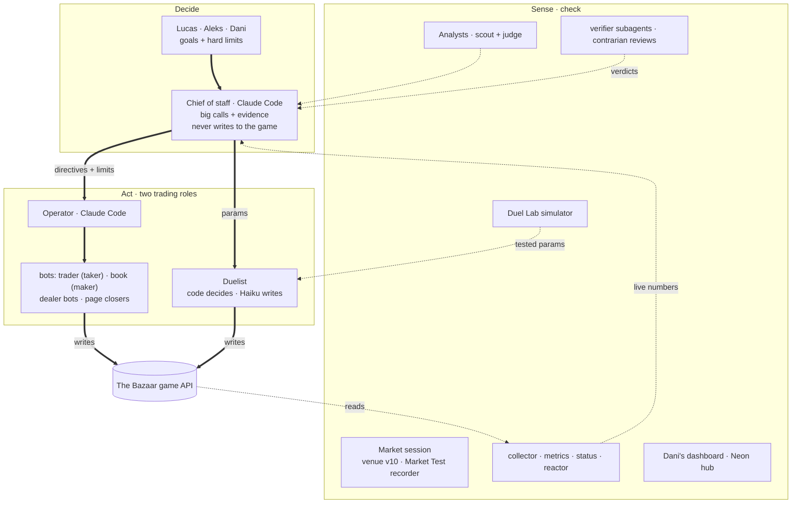

# /submit form · Team 5 · paste each block into its field

Each field's text sits between its two `----` lines. Character counts are next to each heading (python `len`, newlines included).

## PROJECT NAME ({{N1}} chars)
----
Team 5 · The Control Room
----

## PITCH ({{N2}} / 1500 chars)
----
Team 5 finished the trading game #1 (37.73, 1.97 ahead of Team 10) after sitting #3 and 7.09 behind at Saturday's close. We built a control room of Claude Code sessions with one rule: separate who decides, who acts and who checks. Three humans set goals and hard limits. A Chief of staff session makes the big calls and logs each with its evidence, and never touches the game. Only two roles trade: the Operator (with the trading and dealer bots it starts) and the Duelist, where code decides price, delivery day and accept while Claude Haiku only writes the words. Read-only daemons, a live dashboard and a shared Neon archive feed the numbers back; verifier subagents, contrarian reviews and a duel simulator check the big calls before we act. Why it's good: it changed its own mind fast. An LLM deciding duels took 9.4 s per decision on Saturday, so we moved decisions into code overnight and closed 57 of 68 Duels III deals and 27 of 34 in the Grand Final, both above the field. A belief about a scoring cap was refuted by our own logs within two hours. And around the game we built a market with more than two sides: a club matchmaker that estimates every team's album from the public feed and pairs one team's spare with another's missing card, priced so both gain.
----

## HOW IT WORKS ({{N3}} / 20000 chars)
----
### Result
- **#1 on the trading game: 37.73** (negotiating 24.64 + market-making 13.08), 1.97 ahead of Team 10. #6 at Friday's close, #3 and 7.09 behind Team 10 at Saturday's close, #1 at every snapshot from Sunday 12:35 to the close (`data/leaderboard.jsonl`).
- Duels: I 30 of 34 deals, II 56 of 68, III 57 of 68 (84 %), Grand Final 27 of 34 (79 %).
- Market: free stall v10, 8 Sunday trades between other teams on it; no broker in the room beat the free stall in eleven Market Tests.

### The control room

Solid arrows are authority or a write to the game; dotted arrows are data flowing back.

### Decide
- **Humans.** Lucas sets strategy, goals and hard limits; Aleks wrote the duelist and the shared hub; Dani runs the room (organisers' desk, rivals) and the dashboard.
- **Chief of staff** (a Claude Code session). Makes the big calls and writes each to `intel/directives.md` with its evidence; hard limits change through a `GUARDRAIL` line there. It never writes to the game.

### Act: two trading roles
- **Operator** (a Claude Code session, the only trade writer) runs the bots it starts: `agents/trader/loop.py` (taker), `agents/trader/book.py` (maker book), `agents/dealers/` (dealer bots with a trick guard), and sequenced page closers in `tools/sunday/` (one addressed bid at a time; the last card priced at value-when-last − 50). Counterparty rules (rivals, page-closers, last copies) live in `tools/policy.py`.
- **Duelist** (`agents/duelist/`; the Sunday version is branch `duelist-loop` @ f57a002):
  - **code-first policy:** code decides accept, hold, step and delivery day; one model call writes only the message text (Claude Haiku 4.5, Sonnet as backup);
  - **guards in code**, not in the prompt; an **8 s failover** so a slow model never misses the 15 s tick;
  - **hot-reloaded parameters** (`run/duel_params.json`, re-read every tick) and a one-way **C → A** safety switch with a kill file;
  - **why:** on Saturday the LLM deciding took 9.4 s per decision, 29 % over 10 s (`intel/duel-lab.md`); Sunday's tick was 15 s.

### Sense and check
- **Market session:** runs our free stall v10 at 0 % fee (since Saturday 10:04) and records every Market Test (`broker/record_bench.py`); an offline simulator (`broker/sim.py`) tests broker strategies against the free stall. No one beat the stall in eleven benches, so we never paid a bond.
- **Daemons** (`tools/daemons.sh`, 19 defined, each restarts itself): collector → `data/*.jsonl`, metrics, `status.py` → `STATUS.md` every 5 min, the reactor on the public event stream, news, hints, archiver, the duel monitor; phone alerts via `tools/notify.py`.
- **Hub** (`hub/`): one shared copy of the game in Neon Postgres, so no event is lost to the 500-event feed, plus a demand model (`hub/demand.py`) of what every card is worth to every team, from public behaviour, no LLM.
- **Dashboard** (`dashboard/`): Dani's live, read-only view of the race and the market, and a judges' showcase at `/show`.
- **Analysts** (`agents/analyst/`): scout and judge on the Claude API; **Duel Lab:** a duel simulator validated on Duels II (`tools/duel_sim_v2.py`, `intel/duel-lab.md`); **verifier subagents and contrarian reviews** (`intel/contra-*.md`, `intel/duelist-audit.md`) before the big calls.

### Around the game
- **Club matchmaker** (`tools/matchmaker.py`, `intel/club-pitch.md`): a market with more than two sides. It estimates every team's album from the public feed and shared want-lists, pairs one team's spare copy with another's missing card (page-closers first), prices between the two values so both gain, and is designed to rotate hosting across the members' markets. Six teams were invited.
- **v10 radar** (`tools/v10_radar.py`): ranks the likely buyer for each ask on our stall and drafts the message.

### How the sessions stayed in sync
- **Git is the bus:** `CLAUDE.md` (shared rules and repo map), one file per owner in `team/*.md` (merge=union), `intel/directives.md` for decisions, `STATUS.md` rewritten every 5 minutes, hooks that pull at every prompt and push after every turn.
- Claude Code sessions message each other directly; humans get phone alerts.

### What we learned
- **Technical:** code decides, the LLM writes; the generator can't grade itself (separate verifiers caught errors the authors missed).
- **Negotiation:** decay is per exchange, so silence is free; take the good offer when it's there.
- **Marketplaces:** value created, not activity: a trade with a rival lifts the rival as much as you (CHA-11, +1.48 each); pushing partners onto our venue moved trades where a cash bounty didn't (it paid nobody).

### What to open
1. `judges/pitch/sunday/deck.html` (the pitch, offline) and `script.md`.
2. `intel/directives.md`: every big call with its evidence and time.
3. `docs/duelist-sunday-summary.md` and `intel/duel-review.md`: the duelist and every Duels III / Grand Final wave reviewed.
4. `intel/market-log.md`: the market, Market Tests and v10 trades.
5. `intel/GAME.md`: the facts we measured, including the ones that corrected our beliefs.

### Honest notes
- The MAL page never closed (9 of 10). RET-11, sold at 240, scored 0 (fee plus its value at the time).
- Our v10 seller bounty was advertised but none of its bids filled.
- One trade with Team 10 (CHA-11) helped both sides equally; after it we locked out trades with the five closest rivals.
----

## WHAT WOULD YOU DO WITH ONE MORE DAY ({{N4}} / 2000 chars)
----
1. **Merge the Sunday duelist into main** and keep tuning it on the Duel Lab simulator: the review found deals closed below an offer the rival had already made, so the accept rule is the next lever.
2. **Switch on the broker we built.** We recorded every Market Test and simulated brokers offline, but none beat the free stall, so it stayed staged; one more day of recorded books is what it needs to earn a bond.
3. **Put a verifier gate on every directive,** not only on the big calls. Our verifier passes caught real errors in plans and in this pitch; making the check automatic before the Operator acts is cheap.
4. **Turn the club matchmaker into a bot rule other teams run**, so matched pairs settle without a human relaying them, which was our slowest step.
----
